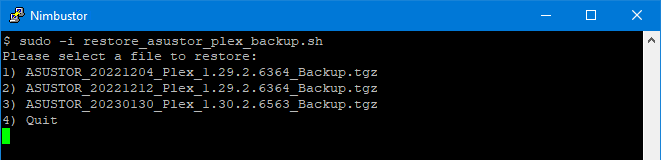

# Linux Plex Backup

<a href="https://github.com/007revad/Linux_Plex_Backup/releases"></a>
<a href="https://hits.seeyoufarm.com"></a>
[](https://www.paypal.com/paypalme/007revad)
[](https://github.com/sponsors/007revad)
[](https://user-badge.committers.top/australia/007revad)

### Description

This is a bash script to backup Linux Plex Media Server settings and database, and log the results.

#### What the script does:

-   Gets your Linux computer's hostname and distro name (for use in the backup filename and log name).
-   Checks that the script is running with the required privileges.
-   Gets Plex Media Server's version (for the backup filename and log).
-   Checks the volume and share name where Plex Media Server's database is located.
-   Checks that your specified backup location exists.
-   Stops Plex Media Server, then checks Plex actually stopped.
-   Backs up Plex Media Server to a tgz file (**excluding the folders listed in plex_backup_exclude.txt**).
-   Starts Plex Media Server.

#### It also saves a log in the same location as the backup file, including:

-   Logging the start and end time plus how long the backup took.
-   Logging every file that was backed up (can be disabled in config file).
-   Logging any errors to a separate error log file to make it easy for you to see if there were errors.

The Linux computer's hostname, date, and Plex Media Server version are included in the backup's filename in case you need to roll Plex back to an older version or you save backups from more than one Plex Servers.

**Example of the backup's auto-generated filenames:** 
-   ubuntu_20221025_Plex_1.29.0.6244_Backup.tgz
-   ubuntu_20221025_Plex_1.29.0.6244_Backup.log
-   ubuntu_20221025_Plex_1.29.0.6244_Backup_ERROR.log (**only if there was an error**)

If you run multiple backups on the same day the time will be included in the filename.

**Example of the backup's auto-generated filenames:** 
-   ubuntu_20221025_1920_Plex_1.29.0.6244_Backup.tgz
-   ubuntu_20221025_1920_Plex_1.29.0.6244_Backup.log

### Download the script

1. Download the latest version _Source code (zip)_ from https://github.com/007revad/Linux_Plex_Backup/releases
2. Save the download zip file to a folder on the Linux computer.
3. Unzip the zip file.

### Settings

You need to set **backupDirectory=** near the top of the script (below the header). Set it to the location where you want the backup saved to. 

```YAML
Backup_Directory=/share/Backups/Plex_Backups
```
or
```YAML
Backup_Directory=/share/folder with spaces/Plex_Backups
```

The script gets the disto and hostname from the NAS to use logs and backup name.
Set Name= to distro, hostname or you can set a 'nickname'. If Name= is blank the Linux computer's hostname will be used.

The LogAll setting enables, or disables, logging every file that gets backed up. Set LogAll= to yes or no. Blank is the same as no.

The KeepQty setting tells the script to keep only keep the latest N backups (and delete older backups).
  - If KeepQty is blank or set to 0 all backups are kept.

```YAML
Name=distro
LogAll=no
KeepQty=5
```

### Requirements

Make sure that backup_linux_plex.config and plex_backup_exclude.txt are in the same folder as Linux_Plex_Backup.sh

**Note:** Due to some of the commands used **this script needs to be** run by a user in sudo, sudoers or wheel group, or as root

If you want the script to send an email of the log after the script finishes you need to have msmtp installed (most Linux distros include msmtp).

### Configuring mstp so the script can send emails

In Linux the msmtprc config file can be either:
```
    /etc/msmtprc
    ~/.msmtprc
    $XDG_CONFIG_HOME/msmtp/config
```

The msmtprc or config usually contains:
```
# Set default values for all following accounts.
defaults
timeout 15
tls on
tls_trust_file /usr/builtin/etc/msmtp/ca-certificates.crt
#logfile ~/.msmtplog

# The SMTP server of the provider.
#account user@gmail.com
#host smtp.gmail.com
#port 587
#from user@gmail.com
#auth on
#user user@gmail.com
#password passwd

# Set a default account
#account default: user@gmail.com
```

### Running the script

Run the script by a user in sudo, sudoers or wheel group.

```YAML
sudo -s "/share/scripts/Linux_Plex_Backup.sh"
```

### Troubleshooting

| Issue | Cause | Solution |
|-------|-------|----------|
| /usr/bin/env: ‘bash\r’: No such file or directory | File has Mac line endings! | [Download latest zip file](https://github.com/007revad/Linux_Plex_Backup/releases) |
| Cursor sits there doing nothing | File has Windows line endings! | [Download latest zip file](https://github.com/007revad/Linux_Plex_Backup/releases) |
| syntax error near unexpected token | You downloaded the webpage! | [Download latest zip file](https://github.com/007revad/Linux_Plex_Backup/releases) |

If you get a "No such file or directory" error check the following:

1. Make sure you unpacked the zip or rar file that you downloaded and are trying to run the Linux_Plex_Backup.sh file.
2. If the path to the script contains any spaces you need to enclose the path/scriptname in double quotes:
   ```YAML
   sudo -s "/share/folder with spaces/Linux_Plex_Backup.sh"
   ```
3. Set the script files as executable:
   ```YAML
   sudo chmod +x "/share/scripts/Linux_Plex_Backup.sh"
   sudo chmod +x "/share/scripts/Restore_Linux_Plex_Backup.sh"
   ```

### Testing the script

If you run the script with the **test** argument it will only backup Plex's Logs folder.

```YAML
sudo -s "/share/scripts/Linux_Plex_Backup.sh" test
```

If you run the script with the **error** argument it will only backup Plex's Logs folder and cause an error so you can test the error logging.

```YAML
sudo -s "/share/scripts/Linux_Plex_Backup.sh" error
```

### Restoring from a backup

To restore Plex from a backup run the included Restore_Linux_Plex_Backup.sh in a shell:

```YAML
sudo -s "/share/scripts/Restore_Linux_Plex_Backup.sh"
```

**Note:** Replace "/share/scripts/" with the path to where Linux Plex Backup's files are located.

The first thing you'll see is a menu listing all of your Plex backups that you created with Linux Plex Backup. Select the backup you want to restore and the sript will do the rest.



**Note:** I would only restore a backup from the same Plex version as you currently have installed (which is why the Plex version is included in the backup file name and logs.

### Restoring a test backup

If you previously ran Linux Plex Backup with the **test** argument you can run Restore_Linux_Plex_Backup.sh with the **test** argument so the menu will list any small backups (less than 1 MiB).

```YAML
sudo -s "/share/scripts/Restore_Linux_Plex_Backup.sh" test
```

**Note:** Replace "/share/scripts/" with the path to where Linux Plex Backup's files are located.
